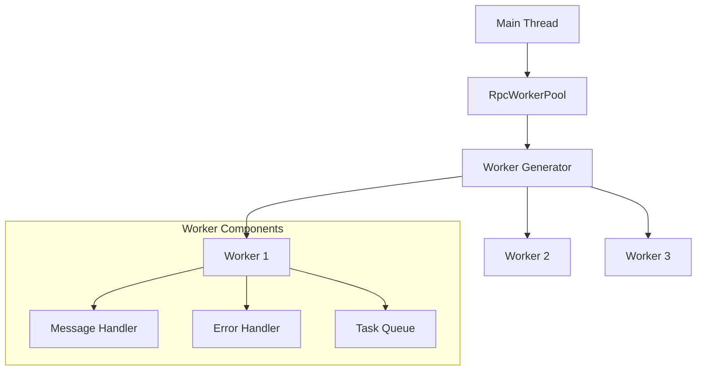
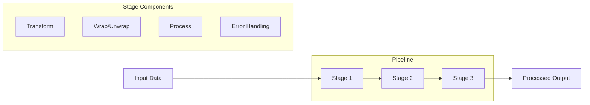
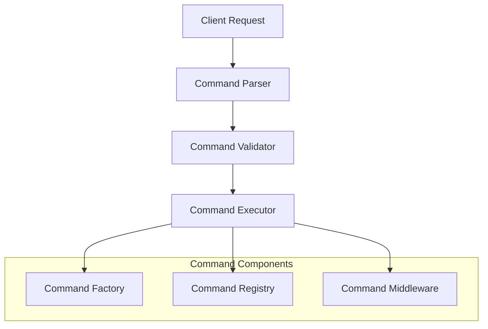

# RPC Worker Pool Architecture

## System Overview

The RPC Worker Pool is designed around the Actor Model pattern, providing a robust foundation for concurrent task processing. This document details the technical architecture and design decisions of the system.

## Core Architecture Components

### 1. Worker Pool Management



#### RpcWorkerPool

- Manages worker lifecycle
- Handles task distribution
- Implements pool scaling logic
- Maintains worker health checks

#### Worker Generator

- Creates worker threads
- Configures worker environment
- Initializes worker communication channels
- Sets up error boundaries

### 2. Pipeline System



#### Pipeline Stages

- Modular processing units
- Composable transformations
- Error boundary per stage
- Data validation between stages

#### Stage Processing

1. Input validation
2. Data transformation
3. Error handling
4. Result packaging

### 3. Command System



#### Command Structure

- Command name
- Parameters validation
- Execution context
- Result formatting

#### Command Processing Flow

1. Parse incoming command
2. Validate parameters
3. Execute command logic
4. Format and return result

### 4. Communication Layer

#### JSON-RPC 2.0 Implementation

```typescript
interface JsonRpcRequest {
  jsonrpc: "2.0";
  method: string;
  params?: any;
  id?: number | string;
}

interface JsonRpcResponse {
  jsonrpc: "2.0";
  result?: any;
  error?: JsonRpcError;
  id: number | string | null;
}
```

#### Error Codes

```typescript
interface JsonRpcError {
  code: number;
  message: string;
  data?: any;
}
```

Error codes follow the JSON-RPC 2.0 specification:

- -32700: Parse error
- -32600: Invalid request
- -32601: Method not found
- -32602: Invalid params
- -32603: Internal error

## Configuration Management

### Configuration Sources (Priority Order)

1. Command line arguments
2. Environment variables
3. Configuration files
4. Default values

### Configuration Schema

```typescript
interface WorkerPoolConfig {
  poolSize: number;
  taskTimeout: number;
  retryAttempts: number;
  maxQueueSize: number;
  workerOptions: {
    resourceLimits: {
      maxOldGenerationSizeMb: number;
      maxYoungGenerationSizeMb: number;
    };
  };
}
```

## Security Considerations

### Worker Isolation

- Separate process boundaries
- Resource limitations
- Error containment

### Input Validation

- Parameter type checking
- Size limits
- Content validation

### Error Handling

- Graceful degradation
- Error propagation
- Recovery mechanisms

## Performance Optimization

### Worker Pool Scaling

- Dynamic pool size adjustment
- Worker health monitoring
- Load balancing strategies

### Resource Management

- Memory usage monitoring
- CPU utilization tracking
- Connection pooling

### Caching Strategy

- Result caching
- Command caching
- Resource caching

## Development Guidelines

### Code Organization

- Modular architecture
- Clear separation of concerns
- Consistent file structure
- TypeScript best practices

### Testing Strategy

- Unit tests for components
- Integration tests for workflows
- Performance benchmarks
- Error scenario testing

### Deployment Considerations

- Docker container configuration
- Environment setup
- Monitoring integration
- Logging strategy

## Future Considerations

### Planned Enhancements

1. Enhanced monitoring capabilities
2. Additional pipeline stages
3. Extended command system
4. Performance optimizations

### Scalability Roadmap

1. Distributed worker pools
2. Cloud integration
3. Horizontal scaling
4. Load balancing improvements
