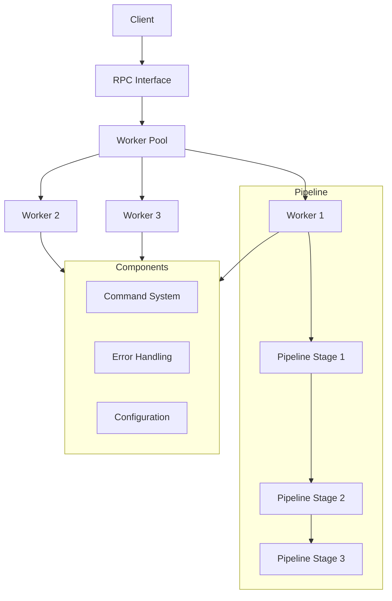

# RPC Worker Pool

## Overview

The RPC Worker Pool is a robust, multi-threaded Remote Procedure Call (RPC) system implemented in Node.js and TypeScript. It leverages the Actor Model pattern for task queue management and is designed to handle high-volume concurrent tasks efficiently. The system utilizes Node.js worker threads to take full advantage of multi-core processors, making it ideal for CPU-intensive or I/O-bound operations.

## Architecture



## Key Components

### Core System

1. **RPC Worker Pool (`/core`)**
   - `RpcWorkerPool.ts`: Main pool management system
   - `RpcWorkerPool-slim.ts`: Lightweight version for reduced resource usage
   - `workerGenerator.ts`: Worker thread creation and management

2. **Server Implementation (`/server`)**
   - Modular pipeline architecture
   - Configuration management system
   - Robust API layer with error handling
   - Job queue management
   - TCP server implementation

3. **Pipeline System (`/Pipe`)**
   - Multi-stage data processing pipeline
   - Composable processing steps
   - Process wrapping/unwrapping capabilities
   - Custom stage implementation support

4. **Command System (`/commands`)**
   - Extensible command framework
   - Command creation tools
   - RPC connector factory
   - Utility methods for command handling

### Communication Protocol

The project implements the JSON-RPC 2.0 protocol for communication between:

- Main thread and worker threads
- External clients and the RPC server
- Internal system components

### Type System

Comprehensive TypeScript type definitions are provided in the `/types` directory:

- JSON-RPC 2.0 specification types
- Worker pool operation types
- Command and message types
- Pipeline stage types
- MCP (Model Context Protocol) schema integration

## Configuration

The system can be configured through:

- Environment variables
- Command line arguments
- Configuration files
- Docker environment settings

## Project Dependencies

### Core Dependencies

```json
{
  "chalk": "4.1.2",
  "@luxcium/bigintstring": "workspace:*",
  "@luxcium/tools": "workspace:*",
  "@luxcium/redis-services": "workspace:*",
  "mapping-tools": "workspace:*",
  "@luxcium/phash-compute": "workspace:*"
}
```

## Getting Started

### Prerequisites

- Node.js v22 or later
- pnpm package manager
- Docker (optional, for containerized deployment)

### Installation

1. Clone the repository:

  ```bash
  git clone <repository-url>
  cd rpc-worker-pool
  ```

2. Install dependencies:

  ```bash
  pnpm install
  ```

3. Build the project:

  ```bash
  pnpm run build
  ```

### Docker Deployment

Build the Docker image:

```bash
pnpm run docker:build
```

Run the server:

```bash
pnpm run docker:live:server
```

Run the actor:

```bash
pnpm run docker:live:actor
```

Stop the services:

```bash
pnpm run stop:docker:live
```

## Development

### Available Scripts

- `pnpm run build`: Build the project
- `pnpm run debug`: Run in debug mode with inspector
- `pnpm run lint`: Run ESLint checks
- `pnpm run lint:fix`: Fix ESLint issues
- `pnpm run prettier`: Format code with Prettier

## Contributing

Please read [CONTRIBUTING.md](./CONTRIBUTING.md) for details on our code of conduct and the process for submitting pull requests.

## License

This project is licensed under the MIT License - see the [LICENSE](LICENSE) file for details.
